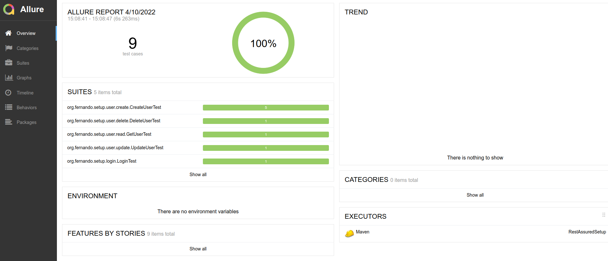

[](https://github.com/teixeira-fernando/restassured-framework-setup/actions/workflows/tests.yml)

# Rest Assured Architecture Setup 

This repository contains the configuration and architecture to create API automated tests using Rest Assured.

<b>The test examples are based on the APIs provided by</b> [Reqres.in](https://reqres.in/)

# Required Software
* Java JDK 11+
* Maven
* [Lombok](https://www.baeldung.com/lombok-ide)

## Libraries used in the project
* [RestAssured](http://rest-assured.io/) library to test REST APIs
* [JUnit 5](https://junit.org/junit5/) to support the test creation
* [Owner](http://owner.aeonbits.org/) to manage the property files
* [java-faker](https://github.com/DiUS/java-faker) to generate fake data
* [Log4J2](https://logging.apache.org/log4j/2.x/) as the logging strategy
* [Allure Report](https://docs.qameta.io/allure/) as the testing report strategy

## Environments
By default, the tests use the properties values from the QA environment, but it is possible to change that using the property `environment`. Check out some possibilities:

| run | command |
|-----|---------|
| local | ```mvn test -Denvironment=local``` |
| develop | ```mvn test -Denvironment=dev``` |
| qa | ```mvn test -Denvironment=qa``` |

## Groups
If you execute `mvn test`, all the tests will be executed by default.

To run different groups/test suites, you can use the property `-D`, including the group name. Take a look on some examples:

| run | command |
|-----|---------|
| login tests | ```mvn -Dgroups="login" test``` |
| user tests | ```mvn -Dgroups="user" test``` |
| all tests | ```mvn test``` |

## Groups + Reports

To automatically generate the test report. You can use the command line to generate it in two ways:

* `mvn allure:serve`: will open the HTML report into the browser
* `mvn allure:report`: will generate the HTML port at target/site/allure-maven-plugin folder



You can also use the profiles to generate reports from a specific test suite:

| run | command |
|-----|---------|
| login report | ```mvn test allure:report -Dgroups="login"``` |
| user report | ```mvn test allure:report -Dgroups="user"``` |
| all tests report | ```mvn test allure:report``` |

The HTML report is generated in the following path: `target > site > allure-maven-plugin > index.html`.

Notice that it is possible to select an environment, a group and generate a report with a unique command:

```mvn test allure:report -Denvironment=dev -Dgroups="user"```

# About the Project Structure

#### baseRequest
Base Test that sets the initial settings to execute requests using RestAssured.

#### commons
It contains any class that is used in the entire project. For example, it has the HeadersDefinition class that
that contains the headers configuration used in all the test requests.

#### config
The class `Configuration` loads the property files located in `src/test/resources/conf`, based on the environment selected for the test run.

```java
@LoadPolicy(LoadType.MERGE)
@Config.Sources({"classpath:conf/${environment}.properties"})
public interface Configuration extends Config{
    ...
}
```

The environment variable is read on the `ConfiguratorManager`.
This class reduces the amount of code necessary to get any information on the properties file.

This strategy uses [Owner](http://owner.aeonbits.org/) library


##### data/factory
Test Data Factory classes using [java-faker](https://github.com/DiUS/java-faker) to generate fake data and [Lombok] to
create the objects using the Builder pattern.

##### data/provider
JUnit 5 Arguments to reduce the amount of code and maintenance for the functional tests on `SimulationsFunctionalTest`

##### data/suite
It contains a class having the data related to the test groups.

##### data/support
Includes classes to generate data part of pre-conditions for some test cases

#### data/model
Model and Builder class to
[map objects thought serialization and deserialization](https://github.com/rest-assured/rest-assured/wiki/Usage#object-mapping)
in use with Rest-Assured.

### src/test/resources
It has a `schemas` folder with the JSON Schemas to enable Contract Testing using Rest-Assured. Also, the properties file to easily configure the API URI.

### Credits to [Elias Nogueira](https://github.com/eliasnogueira) for influencing me with many ideas applied to this project
